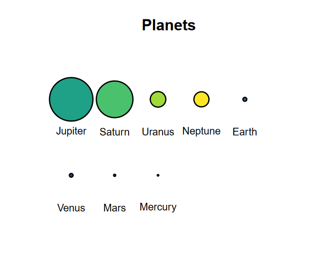

<!-- README.md is generated from README.Rmd. Please edit that file -->

```{r, include = FALSE}
knitr::opts_chunk$set(
  collapse = TRUE,
  comment = "#>",
  fig.path = "man/figures/README-",
  out.width = "100%"
)
```

# circlesplot <a href="https://github.com/BenSt099/circlesplot"></a>

<!-- badges: start -->
[](https://github.com/BenSt099/circlesplot/actions/workflows/R-CMD-check.yaml)
<!-- badges: end -->

## Overview

The __circlesplot__ library helps you display proportions between different objects. Say earth is 3.6 times bigger than the moon. How can you visualize that? It would be helpful if you could draw earth and moon with their exact diameter to make your readers aware of the difference in size. This is where the lib comes into play. It plots two circles with the given diameter next to each other, so readers can observe the ratio. Although it is extremely helpful to visualize planets, it can also be used for other things too.

## Installation

You can install the development version of **circlesplot** from [GitHub](https://github.com/) with:

``` r
# install.packages("devtools")
devtools::install_github("BenSt099/circlesplot")
```


## Usage

You can start by plotting the solar system and its planets:

``` r
library('circlesplot')
library('viridis')

planets = c('Mercury','Venus','Earth','Mars','Jupiter','Saturn','Uranus','Neptune')
diameter = c(4879.4,12103.6,12756.3,6792.4,142984,120536,51118,49528)

circlesplot(cp_vals=diameter, cp_text=planets, cp_max=4L, cp_title="Planets", cp_color=viridis(8))
```

{width=400}
{width=400}

The left plot is exported as *png*, while the right is exported as *pdf*.


## License

This project is licensed under MIT License. Fore more information, click [here](https://github.com/BenSt099/circlesplot/blob/main/LICENSE.md).

