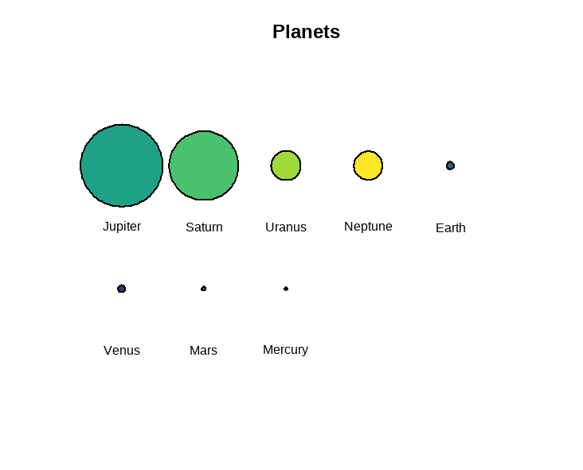

# circlesplot <a href="https://github.com/BenSt099/circlesplot"></a>

<!-- badges: start -->
[](https://github.com/BenSt099/circlesplot/actions/workflows/R-CMD-check.yaml)
<!-- badges: end -->

## Overview

This package provides tools to create circleplots.
These plots can be used to visualize proportions between different objects. The proportions are drawn as circles.

## Installation

``` r
# not yet available
install.packages("circlesplot")
```

## Usage

``` r
library('circlesplot')
library('viridis')

planets = c('Mercury','Venus','Earth','Mars','Jupiter','Saturn','Uranus','Neptune')
diameter = c(4879.4,12103.6,12756.3,6792.4,142984,120536,51118,49528)

circlesplot(cp_vals=diameter, cp_text=planets, cp_max=4L, cp_title="Planets", cp_color=viridis(8))
```

<div style="display: flex;">
    
    
</div>

<div style="display: flex;">
    <p style="flex: 20%; width: 20%; height: auto; padding: 5px;">png-export</p>
    <p style="flex: 20%; width: 20%; height: auto; padding: 5px;">pdf-export</p>
</div>

## License

This project is licensed under MIT License. Fore more information, click [here](https://github.com/BenSt099/circlesplot/blob/main/LICENSE.md).
